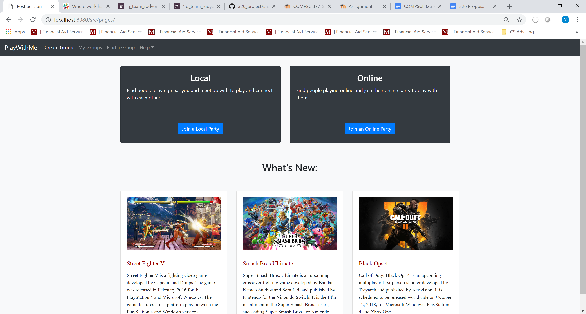
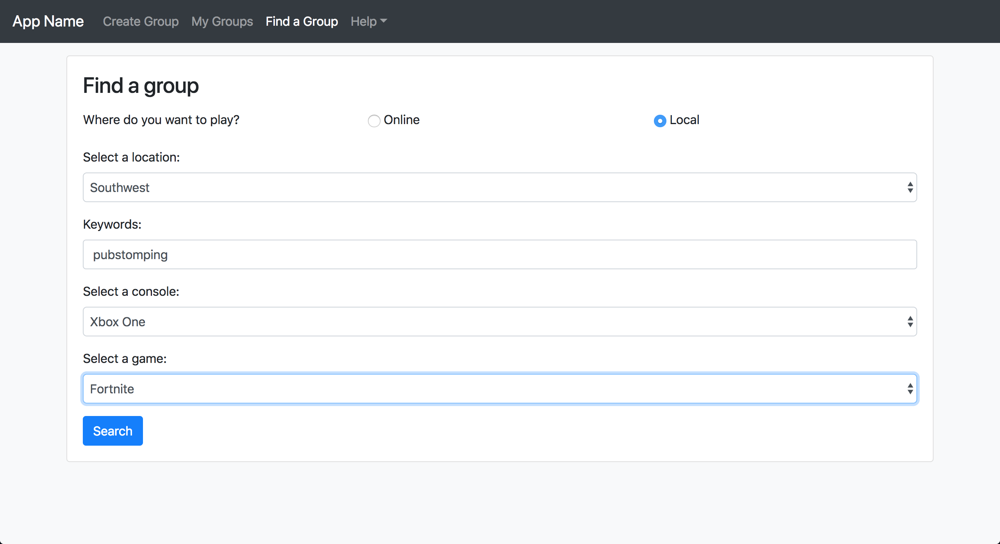
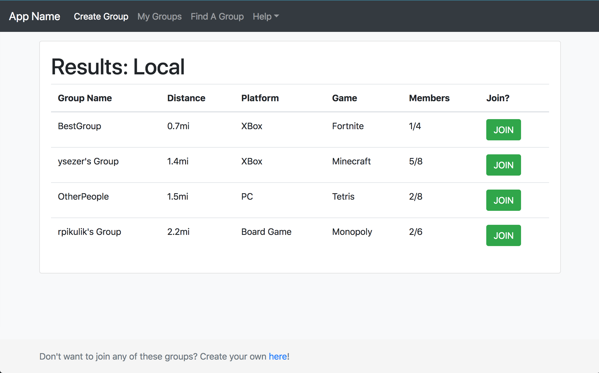
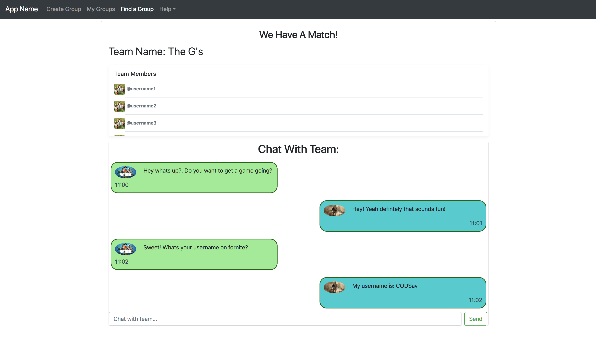
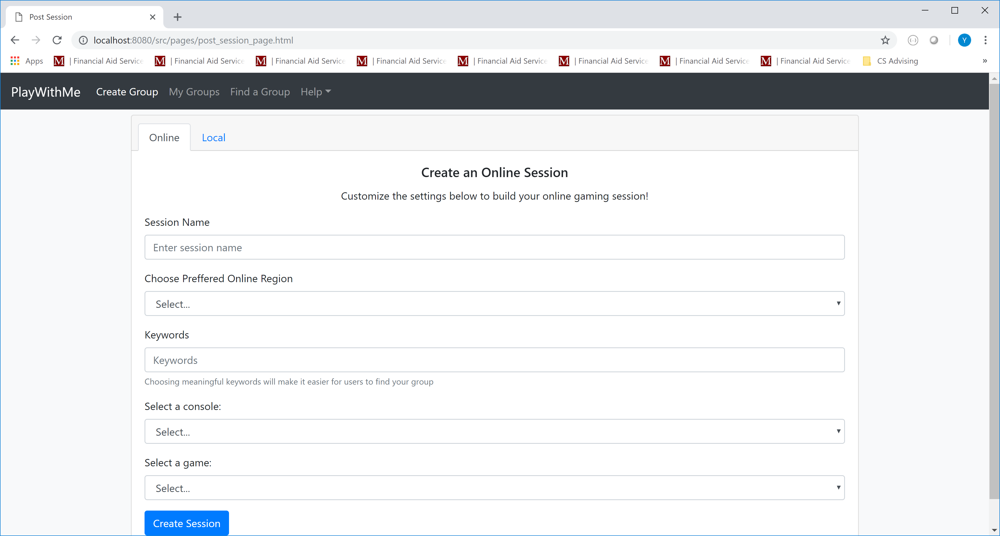

# RudyOnRails

# PlayWithMe

# Team Overview

* Yusuf Sezer, YusufSezer
* Nithin Mahesh, NithinMahesh1
* Navin Lal, nlal43
* Rudy Pikulik, RudyPikulik
* Panav Setia, PanavSetia

# Innovative Idea

PlayWithMe provides a platform for gamers to find and game with each other, locally and online. The platform will allow users to create and post “sessions” for other users to find and join. Each session will have various attributes associated with it, such as number of participants, game(s), platform, local vs. online etc. When a user wants to game with others, they can simply use the application’s search function to find sessions that best match their ideal gaming experience.
For example, a user may post a local session for others who want to play Halo. Other users can search for this session via filtering criteria in the search function (such as geographic distance) or by entering the session’s unique ID. Once a user finds the session, they can communicate with the session host via the built in chat function. If the user wants to participate in the session, they can request to join the session. Upon approval, the session will reflect that the user is now part of the session.
Although our idea revolves around gaming--similar to platforms like Twitch--it does not revolve around streaming. Rather, our application is focused on providing a way for gamers to find a group to play with, both locally and online.

# Important Data

The platform is based off of users creating gaming sessions that others can join. Other than account information, we will have to manage each proposed gaming session including it’s location, game type, game platform, and other important traits. There will also be the ability to communicate with people once a session has been formed. 
	Sessions contain a lot of different types of data as noted above. The most important type of data is the identity of who is joining the session, which is represented as an account. All sessions will be backed with a unique ID, that allows us to keep track of them. It will most likely be represented as a 7 character code. A third type of data is geographical data, which is important to match up gamers who are looking for an in person gaming session. Another type of data is temporal data, which will define when a session is to take place, when a session was created, and when users joined it. Once a session is filled, the members will be able to communicate in real time through messaging. Finally, we hope to add the ability to connect accounts from other platforms such as Xbox Live, which could include a lot of different types of data.

# User Interface

Below is a list of 5 of our application's pages including descriptions and screenshots:

* Home Page
	* Contains two buttons to join a local or online party, and gives descriptions of both. It also has images and text describing and promoting popular games. All of this is formatted using bootstrap.

* Search for group/session page
	* Contains search fields for all of the information collected in the create session page. It includes region, keywords, console, and game. Similar to the create session page, there are dropdowns with common options. There is also two switch buttons to determine an online vs. local search.

* Search results page
	* Shows groups that match with your search criteria ranked by distance. The table shows data such as distance, platform, game, group size and members, and a button to join the group. The table is formatted with bootstrap.

* Group/session page with chat with paired gamers
	* Once a user has matched with a session, the team members are listed in a scrollable card. A chat section is also displayed, allowing team members to communicate. This shows time of message and message text. Other team information, if available, will be shown on this screen. 

* Create group/session page
	* Shows the user a form with all the information needed in order to create a session. There content includes session name, online region, keywords, console, and game. These are all accompanied by drop down menus from bootstrap with common options. There will be “Other” as an option as well. 

